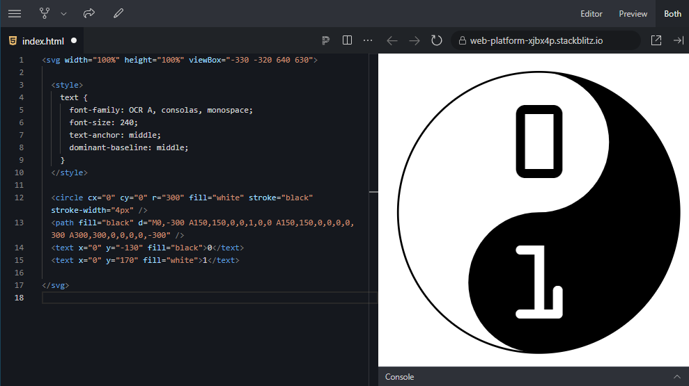

An SVG image is just a text file. You only need a text editor to write the text for the SVG image. The convention is that you save a text file containing an SVG image with the extension `.svg`. When you double-click on a file with an `.svg` extension, you will see the image in a browser.

We will use the online text editor [StackBlitz](https://stackblitz.com/fork/web-platform){: target="_blank"}. This editor obviates the need to install an editor on your computer, and you get to see the result of the image immediately upon each edit.

<div class="dodona-centered-group">
  index.html</samp> file, and immediately get to see the result." />
</div>

Put the text for the SVG image directly into the file `index.html`. There is no need to write HTML code. You can restrict yourself to the SVG image only.

```html
<svg width="100" height="100" viewBox="0 0 100 100">
  <cirkel cx="50" cy="50" r="25" fill="red" />
</svg>
```

If you have created a nice SVG image, don't forget to save it to your computer in a text file with the extension `.svg`!
