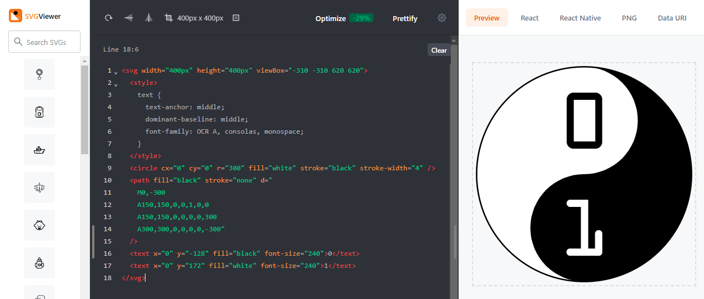

An SVG image is just a text file. You only need a text editor to compose the text for the SVG image. The convention is that you save a text file containing an SVG image using the file extension `.svg`. When you double-click on a file with an `.svg` extension, you get to see the image in a browser.

We will use the online text editor [SVG Viewer](https://www.svgviewer.dev/){: target="_blank"}. This editor obviates the need to install an editor on your computer, and you get to see the result of the image immediately upon each edit. 

<div class="dodona-centered-group">
  
</div>

In the SVG Viewer, you can write the text of an SVG image in the editor on the left. On the right side you will immediately see the result. Conveniently, that editor indicates the border of the SVG image with a dashed line. You can also easily load images from your computer and save them to your computer.

For example, try drawing this SVG image with the SVG Viewer. Can you guess in advance what will be drawn here?

```html
<svg width="100px" height="100px" viewBox="0 0 100 100">
  <cirkel cx="50" cy="50" r="25" fill="red" />
</svg>
```

If you have created a nice SVG image, don't forget to save it to your computer in a text file with the extension `.svg`!