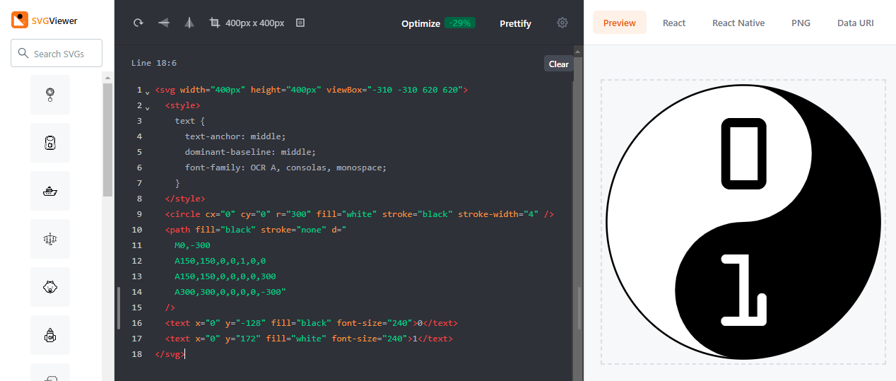

Een SVG-bestand is een tekstbestand. Je hebt enkel een teksteditor nodig om de tekst op te stellen voor de SVG-afbeelding. De afspraak is dat je een tekstbestand met een SVG-afbeelding opslaat met de extensie `.svg`. Wanneer je dubbelklikt op een bestand met een `.svg` extensie, dan krijg je de afbeelding in een browser te zien.

Wij zullen gebruikmaken van de online teksteditor [SVG Viewer](https://www.svgviewer.dev/){: target="_blank"}. Daarmee hoef je helemaal geen editor te installeren op je computer, en krijg je bij elke aanpassing meteen ook het resultaat van de afbeelding te zien.

<div class="dodona-centered-group">
  
</div>

In de SVG Viewer kan je de tekst van een SVG-afbeelding schrijven in de editor aan de linkerkant. Aan de rechterkant krijg je meteen het resultaat te zien. Het is handig dat de rand van de SVG-afbeelding weergegeven wordt met een stippellijn. Je kunt ook makkelijk afbeeldingen ophalen vanaf je computer en opslaan op je computer. 

Probeer bijvoorbeeld deze SVG-afbeelding eens te tekenen met de SVG Viewer. Kan je op voorhand raden wat er hier zal getekend worden?

```html
<svg width="100px" height="100px" viewBox="0 0 100 100">
  <circle cx="50" cy="50" r="25" fill="red" />
</svg>
```

Als je een mooie SVG-afbeelding gemaakt hebt, vergeet die dan ook niet op je computer op te slaan in een tekstbestand met de extensie `.svg`!